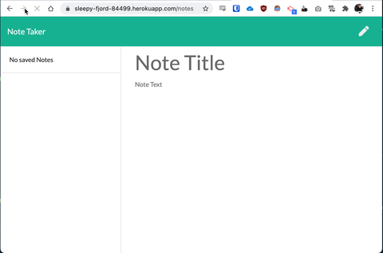

# Not Taking App

This is an express app that allows the user to add and remove notes via a web interface. Notes are stored persistently in a JSON file.

## Table of Contents:

- [License](#License)
- [Screenshots](#Screenshots)
- [Live Demo](#Live-Demo)
- [Technology Stack](#Technology-Stack)
- [Usage](#Usage)
- [Tests](#Tests)
- [Questions](#Questions)

## License

[](https://opensource.org/licenses/MIT)

This project is licensed under the **MIT License**: https://opensource.org/licenses/MIT

## Screenshots

#### Animated Gif Screenshot:



## Live Demo

A live demo of this app is hosted on heroku at https://sleepy-fjord-84499.herokuapp.com/

## Technology Stack

- Express.js: https://expressjs.com/
- dotenv: https://www.npmjs.com/package/dotenv
- shortid: https://www.npmjs.com/package/shortid
- fs: https://nodejs.org/api/fs.html
- path: https://nodejs.org/api/path.html
- WesBos Linting: https://github.com/wesbos/eslint-config-wesbos
- Heroku: https://www.heroku.com/

## Usage

To use the program simply run the program from your preferred terminal and follow the prompts.

```bash
npm start
```

## Tests

No tests have been written for this software.

## Questions

If you have any further questions you can get in contact with the creator through the following methods:

- https://github.com/daveholst/
- dholst@glenholst.com.au
